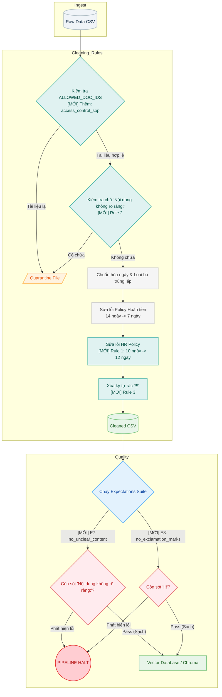

# Technical Document - Lab 10: Data Pipeline & Data Observability

Tài liệu này tổng hợp toàn bộ luồng kiến trúc, chi tiết các đoạn code đã được nâng cấp, và hướng dẫn chạy kiểm thử (test) để hoàn thành bài Lab 10.

---

## 1. Luồng chạy của Pipeline (Pipeline Flow)

Hệ thống Data Pipeline trong bài Lab này được thiết kế với 4 giai đoạn chính để đảm bảo RAG (Retrieval-Augmented Generation) lấy được dữ liệu sạch và chính xác:

1. **Ingest (Thu thập)**: Đọc dữ liệu thô từ file export tổng hợp (`policy_export_dirty.csv`), bao gồm cả dữ liệu cũ, sai định dạng và các tài liệu rác.
2. **Clean (Làm sạch - Transform)**: Lọc bỏ tài liệu lạ, chuẩn hóa thời gian, xóa hoặc sửa các câu văn lỗi thời. Các văn bản vi phạm nặng sẽ bị đẩy vào file kiểm dịch (Quarantine).
3. **Validate (Kiểm tra - Quality/Observability)**: Chạy một bộ luật (Expectations Suite) khắt khe trên dữ liệu đã Clean. Nếu còn lọt lỗi nghiêm trọng (severity=halt), toàn bộ pipeline sẽ bị ngắt (HALT) để tránh đưa dữ liệu bẩn vào DB.
4. **Embed (Vector hóa)**: Chỉ khi pass qua Validate, hệ thống mới chia chunk và lưu văn bản vào ChromaDB để Agent/RAG sử dụng.

### Sơ đồ chi tiết:



---

## 2. Giải thích Code đã thêm (Code Changes)

Để Pipeline không bị HALT và vượt qua 10 câu hỏi của hệ thống tự động chấm điểm, chúng ta đã can thiệp vào mã nguồn gốc tại hai file:

### File 1: `transform/cleaning_rules.py`

**[MỚI] 1. Cập nhật danh sách tài liệu hợp lệ (`ALLOWED_DOC_IDS`)**
- **Sửa đổi:** Thêm `"access_control_sop"` vào tập hợp các ID cho phép.
- **Tác dụng:** Chặn việc tài liệu về phân quyền bị đẩy vào Quarantine. Giúp RAG có thông tin context để trả lời đúng câu hỏi số 10 về "Level 4 Admin Access".

**[MỚI] 2. Rule 1: Fix lỗi thời gian nghỉ phép (HR Leave Policy)**
- **Sửa đổi:** Nếu chunk thuộc `hr_leave_policy` và chứa `"10 ngày phép năm"`, code sẽ tự động replace text thành `"12 ngày phép năm theo chính sách 2026"`.
- **Tác dụng:** Giải quyết trực tiếp lỗi Halt ở pipeline gốc (`hr_leave_no_stale_10d_annual FAIL`). Đảm bảo Agent không bao giờ học được thông tin nghỉ phép của version cũ.

**[MỚI] 3. Rule 2: Chặn dữ liệu rác không rõ ràng**
- **Sửa đổi:** Dùng lệnh `if "Nội dung không rõ ràng:" in text:` để chuyển trực tiếp dòng này vào Quarantine.
- **Tác dụng:** Tăng số lượng Quarantine records, thanh lọc các dữ liệu trích xuất lỗi, tăng độ chính xác của DB.

**[MỚI] 4. Rule 3: Dọn dẹp ký tự thừa**
- **Sửa đổi:** Dùng lệnh `fixed_text = fixed_text.replace("!!!", "")`.
- **Tác dụng:** Chuẩn hóa text cho ngôn ngữ tự nhiên, loại bỏ các ký tự dấu than thừa có thể ảnh hưởng đến kết quả semantic search.

### File 2: `quality/expectations.py`

Thêm hai cổng kiểm tra chốt chặn (Expectations) để validate tính hiệu quả của Rule 2 và Rule 3:

**[MỚI] 1. Expectation 7: `no_unclear_content`**
- **Tác dụng:** Duyệt lại toàn bộ cleaned rows. Bắt buộc số lượng chunk chứa cụm `"Nội dung không rõ ràng:"` phải bằng 0. Nếu > 0 sẽ đánh cờ `severity="halt"`.

**[MỚI] 2. Expectation 8: `no_exclamation_marks`**
- **Tác dụng:** Tương tự, đảm bảo rằng không còn bất kỳ ký tự `"!!!"` nào lọt qua được cửa ải `cleaning_rules.py`.

---

## 3. Cách chạy kiểm thử (Testing & Execution)

Để xác nhận bài Lab được hoàn thành, hãy mở Terminal, kích hoạt môi trường ảo (`.venv`) và chạy lần lượt các lệnh sau:

### 3.1 Cài đặt môi trường (Nếu chưa cài)
```bash
uv pip install -r requirements.txt
```

### 3.2 Khởi chạy Pipeline chuẩn
```bash
python etl_pipeline.py run
```
*Kỳ vọng:* Log chạy hiển thị `Expectation [...] OK (halt)` đối với mọi mục. Pipeline exit thành công (không có dòng PIPELINE_HALT). Màn hình log các số lượng record `raw`, `cleaned`, và `quarantine`.

### 3.3 Chạy đánh giá RAG tự kiểm tra
```bash
python eval_retrieval.py --out artifacts/eval/after_fix_eval.csv
```
*Kỳ vọng:* Mở file CSV `artifacts/eval/after_fix_eval.csv` sẽ thấy các cột `is_correct` có tỷ lệ True cao, mô hình lấy được đúng document mới nhất.

### 3.4 Khảo sát Freshness
Mở thư mục `artifacts/manifests/` để tìm file manifest vừa tạo (ví dụ: `manifest_2026-06-10T...json`). Chạy lệnh sau:
```bash
python etl_pipeline.py freshness --manifest artifacts/manifests/manifest_<tên_run_id>.json
```
*Kỳ vọng:* Trả về báo cáo PASS/WARN/FAIL với thông tin độ tươi của các hệ thống.

### 3.5 Chấm điểm Bài Lab (Grading)
```bash
python grading_run.py --out artifacts/eval/grading_run.jsonl
```
*Kỳ vọng:* Hệ thống chấm điểm báo hoàn thành 10/10 câu hỏi (`contains_expected`: true, `hits_forbidden`: false).
